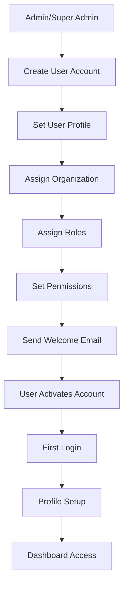
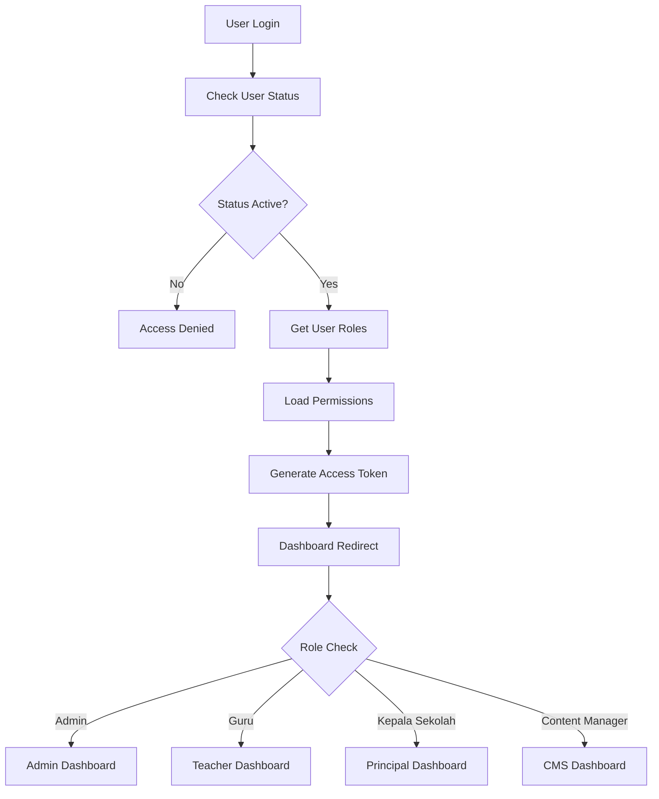
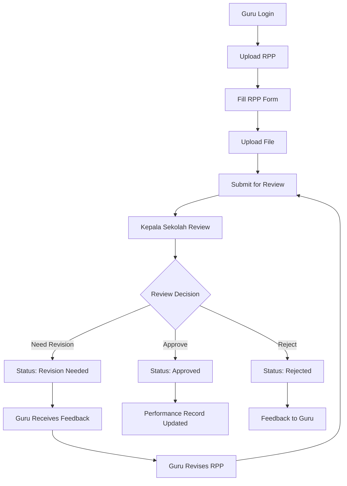
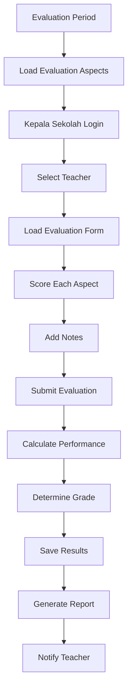

# Unified System Documentation
## Database Schema & Business Process 

> **Comprehensive documentation for the unified Proyek Fatur system implementing DRY principles and best practices**

---

## 1. Unified Database Schema (SQL)

### 1.1 Core Tables

```sql
-- Organizations Table (Replaces duplicate schools tables)
CREATE TABLE organizations (
    id INT PRIMARY KEY AUTO_INCREMENT,
    name VARCHAR(255) NOT NULL,
    slug VARCHAR(255) UNIQUE,
    type ENUM('school', 'foundation', 'department') DEFAULT 'school',
    description TEXT,
    image_url VARCHAR(255),
    website_url VARCHAR(255),
    contact_info JSON COMMENT 'Contact details: phone, email, address, etc',
    settings JSON COMMENT 'Organization-specific settings',
    created_at TIMESTAMP DEFAULT CURRENT_TIMESTAMP,
    updated_at TIMESTAMP DEFAULT CURRENT_TIMESTAMP ON UPDATE CURRENT_TIMESTAMP,
    
    INDEX idx_org_type (type),
    INDEX idx_org_slug (slug),
    INDEX idx_org_name (name)
);

-- Unified Users Table
CREATE TABLE users (
    id INT PRIMARY KEY AUTO_INCREMENT,
    email VARCHAR(255) UNIQUE NOT NULL,
    password VARCHAR(255) NOT NULL,
    profile JSON NOT NULL COMMENT 'User profile: name, phone, address, etc',
    organization_id INT,
    status ENUM('active', 'inactive', 'suspended') DEFAULT 'active',
    email_verified_at TIMESTAMP NULL,
    last_login_at TIMESTAMP NULL,
    remember_token VARCHAR(100),
    created_at TIMESTAMP DEFAULT CURRENT_TIMESTAMP,
    updated_at TIMESTAMP DEFAULT CURRENT_TIMESTAMP ON UPDATE CURRENT_TIMESTAMP,
    
    FOREIGN KEY (organization_id) REFERENCES organizations(id) ON DELETE SET NULL,
    INDEX idx_user_email (email),
    INDEX idx_user_org (organization_id),
    INDEX idx_user_status (status)
);

-- Role-based Access Control
CREATE TABLE user_roles (
    id INT PRIMARY KEY AUTO_INCREMENT,
    user_id INT NOT NULL,
    role_name VARCHAR(50) NOT NULL COMMENT 'admin, guru, kepala_sekolah, content_manager, etc',
    permissions JSON COMMENT 'Specific permissions for the role',
    organization_id INT,
    is_active BOOLEAN DEFAULT TRUE,
    created_at TIMESTAMP DEFAULT CURRENT_TIMESTAMP,
    expires_at TIMESTAMP NULL,
    
    FOREIGN KEY (user_id) REFERENCES users(id) ON DELETE CASCADE,
    FOREIGN KEY (organization_id) REFERENCES organizations(id) ON DELETE CASCADE,
    UNIQUE KEY unique_user_role_org (user_id, role_name, organization_id),
    INDEX idx_role_user (user_id),
    INDEX idx_role_org (organization_id),
    INDEX idx_role_name (role_name)
);

-- Unified File Management
CREATE TABLE media_files (
    id INT PRIMARY KEY AUTO_INCREMENT,
    file_path VARCHAR(255) NOT NULL,
    file_name VARCHAR(255) NOT NULL,
    file_type VARCHAR(50) NOT NULL,
    file_size INT NOT NULL,
    mime_type VARCHAR(100) NOT NULL,
    uploader_id INT,
    organization_id INT,
    metadata JSON COMMENT 'File metadata: width, height, duration, etc',
    is_public BOOLEAN DEFAULT FALSE,
    created_at TIMESTAMP DEFAULT CURRENT_TIMESTAMP,
    
    FOREIGN KEY (uploader_id) REFERENCES users(id) ON DELETE SET NULL,
    FOREIGN KEY (organization_id) REFERENCES organizations(id) ON DELETE CASCADE,
    INDEX idx_media_uploader (uploader_id),
    INDEX idx_media_org (organization_id),
    INDEX idx_media_type (file_type),
    INDEX idx_media_public (is_public)
);
```

### 1.2 PKG System Tables

```sql
-- RPP Submissions (Enhanced)
CREATE TABLE rpp_submissions (
    id INT PRIMARY KEY AUTO_INCREMENT,
    teacher_id INT NOT NULL,
    academic_year VARCHAR(20) NOT NULL,
    semester VARCHAR(20) NOT NULL,
    rpp_type VARCHAR(100) NOT NULL,
    file_id INT NOT NULL,
    status ENUM('pending', 'approved', 'rejected', 'revision_needed') DEFAULT 'pending',
    reviewer_id INT,
    review_notes TEXT,
    revision_count INT DEFAULT 0,
    submitted_at TIMESTAMP DEFAULT CURRENT_TIMESTAMP,
    reviewed_at TIMESTAMP NULL,
    
    FOREIGN KEY (teacher_id) REFERENCES users(id) ON DELETE CASCADE,
    FOREIGN KEY (reviewer_id) REFERENCES users(id) ON DELETE SET NULL,
    FOREIGN KEY (file_id) REFERENCES media_files(id) ON DELETE CASCADE,
    INDEX idx_rpp_teacher (teacher_id),
    INDEX idx_rpp_year_semester (academic_year, semester),
    INDEX idx_rpp_status (status),
    INDEX idx_rpp_reviewer (reviewer_id)
);

-- Evaluation Aspects (Enhanced)
CREATE TABLE evaluation_aspects (
    id INT PRIMARY KEY AUTO_INCREMENT,
    aspect_name VARCHAR(255) NOT NULL,
    category VARCHAR(100) NOT NULL,
    description TEXT,
    weight DECIMAL(3,2) DEFAULT 1.00,
    min_score INT DEFAULT 1,
    max_score INT DEFAULT 4,
    is_active BOOLEAN DEFAULT TRUE,
    organization_id INT,
    created_at TIMESTAMP DEFAULT CURRENT_TIMESTAMP,
    updated_at TIMESTAMP DEFAULT CURRENT_TIMESTAMP ON UPDATE CURRENT_TIMESTAMP,
    
    FOREIGN KEY (organization_id) REFERENCES organizations(id) ON DELETE SET NULL,
    INDEX idx_aspect_category (category),
    INDEX idx_aspect_org (organization_id),
    INDEX idx_aspect_active (is_active)
);

-- Teacher Evaluations (Enhanced)
CREATE TABLE teacher_evaluations (
    id INT PRIMARY KEY AUTO_INCREMENT,
    evaluator_id INT NOT NULL,
    teacher_id INT NOT NULL,
    aspect_id INT NOT NULL,
    academic_year VARCHAR(20) NOT NULL,
    semester VARCHAR(20) NOT NULL,
    score INT NOT NULL,
    notes TEXT,
    evaluation_date TIMESTAMP DEFAULT CURRENT_TIMESTAMP,
    
    FOREIGN KEY (evaluator_id) REFERENCES users(id) ON DELETE CASCADE,
    FOREIGN KEY (teacher_id) REFERENCES users(id) ON DELETE CASCADE,
    FOREIGN KEY (aspect_id) REFERENCES evaluation_aspects(id) ON DELETE CASCADE,
    UNIQUE KEY unique_evaluation (teacher_id, aspect_id, academic_year, semester),
    INDEX idx_eval_teacher (teacher_id),
    INDEX idx_eval_evaluator (evaluator_id),
    INDEX idx_eval_year_semester (academic_year, semester),
    INDEX idx_eval_date (evaluation_date)
);

-- Evaluation Results (Enhanced)
CREATE TABLE evaluation_results (
    id INT PRIMARY KEY AUTO_INCREMENT,
    teacher_id INT NOT NULL,
    evaluator_id INT NOT NULL,
    academic_year VARCHAR(20) NOT NULL,
    semester VARCHAR(20) NOT NULL,
    total_score INT NOT NULL,
    max_score INT NOT NULL,
    performance_value DECIMAL(5,2) NOT NULL,
    grade_category VARCHAR(50) NOT NULL,
    recommendations TEXT,
    evaluation_date TIMESTAMP DEFAULT CURRENT_TIMESTAMP,
    
    FOREIGN KEY (teacher_id) REFERENCES users(id) ON DELETE CASCADE,
    FOREIGN KEY (evaluator_id) REFERENCES users(id) ON DELETE CASCADE,
    UNIQUE KEY unique_result (teacher_id, academic_year, semester),
    INDEX idx_result_teacher (teacher_id),
    INDEX idx_result_year_semester (academic_year, semester),
    INDEX idx_result_grade (grade_category)
);
```


```

---

## 2. Business Process Documentation

### 2.1 User Management Process

#### A. User Registration & Authentication


**Process Steps:**
1. **Admin Creates User**: Admin fills user form with basic info
2. **Profile Setup**: JSON profile data includes name, phone, address
3. **Organization Assignment**: User linked to specific organization
4. **Role Assignment**: Multiple roles possible (guru, kepala_sekolah, etc.)
5. **Permission Setting**: Granular permissions via JSON
6. **Email Verification**: User receives activation email
7. **Account Activation**: User clicks link to activate
8. **Dashboard Access**: Role-based dashboard redirection

#### B. Role-Based Access Control


**Role Definitions:**
- **Admin**: Full system access, user management
- **Guru**: RPP management, view evaluations
- **Kepala Sekolah**: Teacher evaluations, RPP approvals
- **Content Manager**: Website content management
- **Super Admin**: Multi-organization management

### 2.2 PKG System Business Process

#### A. RPP Management Process


**Process Details:**
1. **RPP Upload**: 
   - Teacher selects academic year, semester, RPP type
   - Uploads file (PDF/DOC) to media_files table
   - System creates record in rpp_submissions
   
2. **Review Process**:
   - Principal receives notification
   - Reviews RPP content and quality
   - Provides feedback in review_notes
   - Updates status and reviewed_at timestamp
   
3. **Revision Handling**:
   - System tracks revision_count
   - Previous versions maintained
   - Notification sent to teacher
   - Re-submission creates new version

#### B. Teacher Evaluation Process


**Evaluation Workflow:**
1. **Setup Phase**:
   - Evaluation aspects loaded from database
   - Academic year and semester specified
   - Weight calculations applied
   
2. **Scoring Phase**:
   - Each aspect scored (1-4 scale)
   - Notes added for justification
   - Real-time calculation preview
   
3. **Calculation Phase**:
   - Total score = Sum of (score × weight)
   - Performance value = Total score × 1.25
   - Grade category determined by performance value
   
4. **Result Storage**:
   - Individual scores saved to teacher_evaluations
   - Summary saved to evaluation_results
   - Audit log created for changes

---