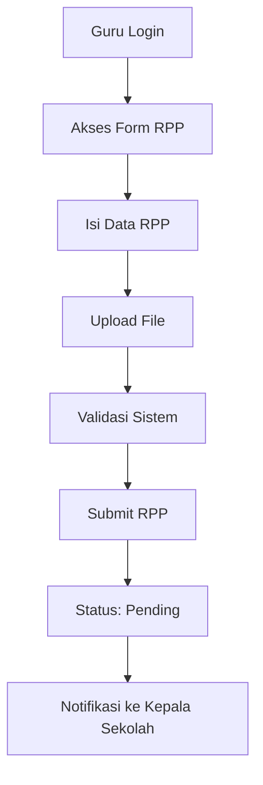
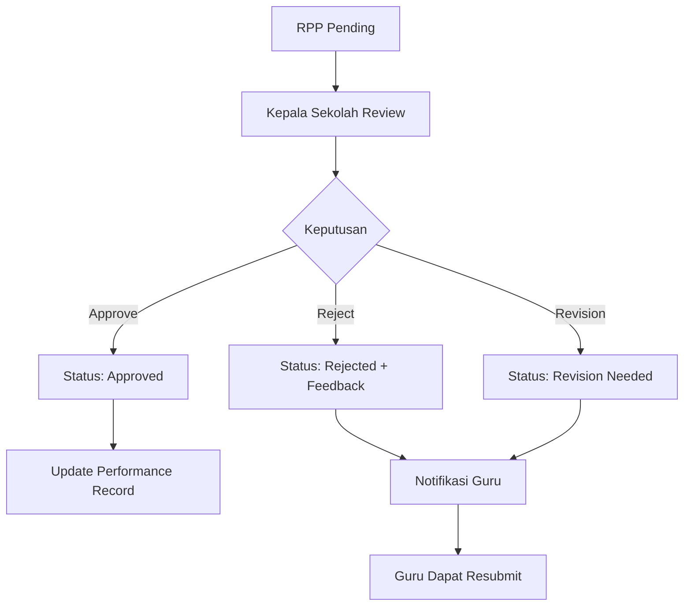
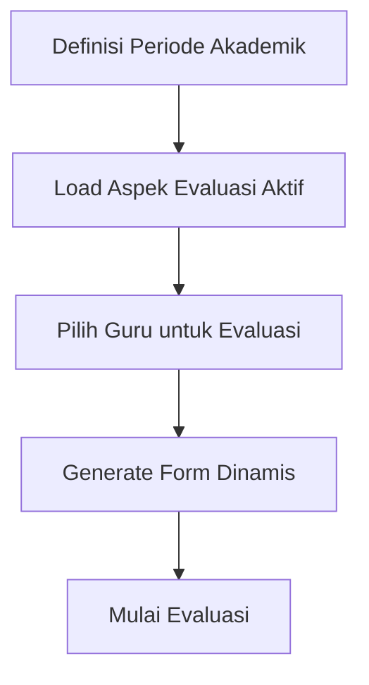
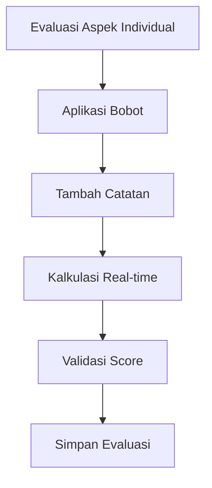
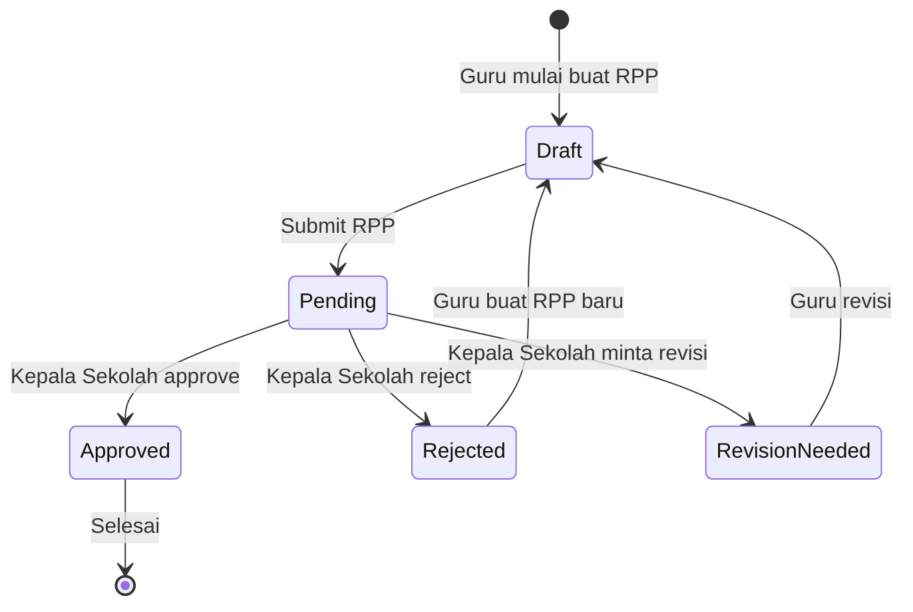
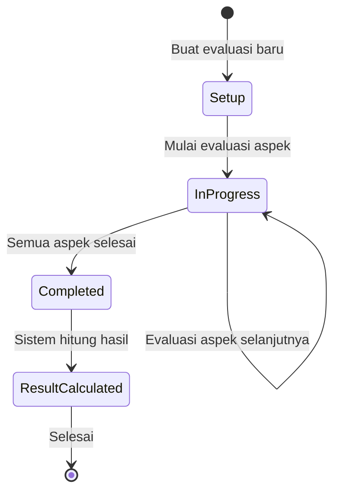

# PKG (Penilaian Kinerja Guru) - Business Process Schema

## 1. System Overview

PKG adalah sistem penilaian kinerja guru yang mengelola seluruh siklus evaluasi guru mulai dari pengajuan RPP hingga hasil evaluasi akhir. Sistem ini mengimplementasikan kontrol akses berbasis peran dengan alur kerja yang jelas untuk setiap stakeholder.

## 2. Actor dan Peran

### Actor Utama:
- **Super Admin** (`super_admin`): Akses penuh sistem, manajemen multi-organisasi
- **Admin** (`admin`): Fungsi administratif, manajemen pengguna
- **Kepala Sekolah** (`kepala_sekolah`): Evaluator utama dan reviewer RPP
- **Guru** (`guru`): Mengajukan RPP dan menerima evaluasi
- **Content Manager** (`content_manager`): Manajemen konten website dan media

### Actor Pendukung:
- **Organisasi**: Sekolah, yayasan, atau departemen tempat guru bekerja
- **Sistem**: Kalkulasi otomatis dan notifikasi

## 3. Entitas Bisnis Utama

### Diagram Relasi:
```
Organisasi (1) ←→ (N) Pengguna
Pengguna (1) ←→ (N) Peran Pengguna
Pengguna (Guru) (1) ←→ (N) Pengajuan RPP
Pengguna (Reviewer) (1) ←→ (N) Pengajuan RPP (yang di-review)
Pengguna (Guru) (1) ←→ (N) Evaluasi Guru (yang dievaluasi)
Pengguna (Evaluator) (1) ←→ (N) Evaluasi Guru (yang melakukan)
Aspek Evaluasi (1) ←→ (N) Evaluasi Guru
Evaluasi Guru (N) ←→ (1) Hasil Evaluasi
```

## 4. Proses Bisnis Utama

### A. Proses Manajemen RPP

**Status Workflow**: `pending` → `approved` | `rejected` | `revision_needed`

#### 4.1 Alur Pengajuan RPP:



**Langkah Detail:**
1. **Inisiasi Guru**: Guru login dan mengakses form pengajuan RPP
2. **Pengisian Form**:
   - Pilih tahun akademik dan semester
   - Tentukan jenis RPP (mata pelajaran/topik)
   - Upload file (PDF/DOC) ke sistem media
3. **Validasi**: Sistem validasi format file dan cek duplikasi
4. **Pengajuan**: Buat record dengan status `pending`, catat timestamp
5. **Notifikasi**: Kepala Sekolah menerima notifikasi review

#### 4.2 Alur Review RPP:



**Langkah Detail:**
1. **Assignment Review**: Sistem otomatis assign atau admin manual assign reviewer
2. **Evaluasi Review**: Kepala Sekolah review konten dan berikan keputusan:
   - **Approve**: Status → `approved`, update performance record
   - **Reject**: Status → `rejected`, feedback detail diperlukan
   - **Minta Revisi**: Status → `revision_needed`, increment revision_count
3. **Delivery Feedback**: Guru menerima notifikasi dengan review_notes
4. **Resubmission**: Untuk kasus reject/revisi, guru dapat resubmit (buat versi baru)

#### 4.3 Aturan Bisnis RPP:
- Hanya satu RPP per guru per periode akademik per jenis RPP
- Hanya submission pending yang bisa diupdate
- Revision count dilacak untuk audit
- File versioning dipertahankan untuk referensi historis

### B. Proses Evaluasi Guru

**Formula Inti**: `Nilai Kinerja = Total Skor × 1.25`

#### 4.4 Setup Evaluasi:



#### 4.5 Proses Penilaian:



**Langkah Detail:**
1. **Scoring Aspek Individual**: Setiap aspek dinilai pada skala yang ditentukan (biasanya 1-4)
2. **Aplikasi Bobot**: Skor dikalikan dengan bobot aspek
3. **Penambahan Catatan**: Evaluator memberikan catatan justifikasi
4. **Kalkulasi Real-time**: Sistem menampilkan preview kinerja yang dihitung
5. **Validasi**: Pastikan skor dalam rentang valid untuk setiap aspek

#### 4.6 Kalkulasi Hasil:

```mermaid
graph TD
    A[Agregasi Skor] --> B[Kalkulasi Kinerja]
    B --> C[Tentukan Grade]
    C --> D[Simpan Hasil]
    
    E[Total Skor = Σ(Skor × Bobot)] --> A
    F[Nilai Kinerja = Total Skor × 1.25] --> B
    G[Grade berdasarkan Threshold] --> C
```

**Formula dan Grading:**
1. **Agregasi**: `Total Skor = Σ(Skor Individual × Bobot)`
2. **Kalkulasi Kinerja**: `Nilai Kinerja = Total Skor × 1.25`
3. **Penentuan Grade**:
   - **Sangat Baik** (≥90%): Melebihi ekspektasi
   - **Baik** (80-89%): Memenuhi dan kadang melebihi ekspektasi
   - **Cukup** (70-79%): Memenuhi ekspektasi dasar
   - **Perlu Perbaikan** (<70%): Di bawah ekspektasi

#### 4.7 Aturan Bisnis Evaluasi:
- Satu evaluasi per guru per aspek per periode akademik
- Aspek harus aktif untuk digunakan dalam evaluasi
- Skor harus dalam rentang min/max aspek
- Constraint unik mencegah evaluasi duplikat
- Weighted scoring memungkinkan assignment kepentingan fleksibel

### C. Manajemen Data dan Analytics

#### 4.8 Performance Tracking:
- **Progress Individual**: Tren kinerja guru dari waktu ke waktu
- **Analisis Komparatif**: Kinerja guru vs rata-rata organisasi
- **Ringkasan Periode**: Kinerja seluruh sekolah untuk periode tertentu
- **Top Performers**: Identifikasi guru teladan
- **Perlu Perbaikan**: Guru yang memerlukan dukungan pengembangan

#### 4.9 Audit dan Compliance:
- Audit trail lengkap untuk semua evaluasi
- Riwayat revisi untuk submission RPP
- Logging akses untuk monitoring keamanan
- Kontrol akses data berbasis permission

## 5. Aturan Bisnis dan Constraint Kunci

### Aturan Integritas Data:
1. **Constraint Keunikan**:
   - Satu submission RPP per guru/periode/jenis kombinasi
   - Satu evaluasi per guru/aspek/periode kombinasi
   - Satu hasil evaluasi per guru per periode akademik

2. **Aturan Validasi**:
   - Skor harus dalam rentang yang ditentukan aspek
   - File harus memenuhi requirement format
   - User harus punya peran yang sesuai untuk aksi
   - Periode akademik harus format valid

3. **Aturan Transisi State**:
   - Hanya RPP pending yang bisa diedit
   - Hanya aspek aktif yang bisa digunakan untuk evaluasi
   - Hasil evaluasi immutable setelah dibuat
   - Permission peran enforces action boundaries

### Constraint Logika Bisnis:
1. **Constraint Temporal**:
   - Tahun akademik mengikuti format standar (contoh: "2023/2024")
   - Semester distandarisasi ("Ganjil", "Genap")
   - Periode evaluasi punya window yang ditentukan

2. **Constraint Organisasi**:
   - User belong ke organisasi spesifik
   - Evaluasi biasanya terjadi dalam organisasi sama
   - Permission peran respects organizational boundaries

3. **Constraint Performance**:
   - Skala evaluasi standar 4-point
   - Multiplier 1.25 untuk kalkulasi kinerja
   - Threshold grade distandarisasi across sistem

## 6. Flow Diagram Proses Utama

### 6.1 Complete RPP Workflow



### 6.2 Complete Evaluation Workflow



## 7. Matriks Peran dan Akses

| Fungsi | Super Admin | Admin | Kepala Sekolah | Guru | Content Manager |
|--------|-------------|-------|----------------|------|-----------------|
| Manajemen User | ✓ | ✓ | ✓ (terbatas) | ✗ | ✗ |
| Submit RPP | ✗ | ✗ | ✗ | ✓ | ✗ |
| Review RPP | ✓ | ✓ | ✓ | ✗ | ✗ |
| Buat Evaluasi | ✓ | ✓ | ✓ | ✗ | ✗ |
| Lihat Hasil Evaluasi | ✓ | ✓ | ✓ | ✓ (sendiri) | ✗ |
| Manajemen Aspek | ✓ | ✓ | ✓ | ✗ | ✗ |
| Manajemen Media | ✓ | ✓ | ✗ | ✗ | ✓ |
| Analytics | ✓ | ✓ | ✓ | ✓ (terbatas) | ✗ |

## 8. Integrasi Sistem

### Dependency Eksternal:
- **File Storage**: Manajemen media file untuk dokumen RPP
- **Email System**: Notifikasi untuk submission dan evaluasi
- **Authentication**: Keamanan berbasis JWT dengan verifikasi peran
- **Database**: Integritas transaksional untuk data evaluasi

### Integrasi Internal:
- **User Management**: Kontrol akses berbasis peran
- **Organization Management**: Separasi data multi-tenant
- **Analytics Engine**: Kalkulasi kinerja dan reporting
- **Audit System**: Change tracking dan compliance monitoring

## 9. Faktor Kesuksesan Kritis

### Operational Excellence:
1. **Akurasi Data**: Scoring dan kalkulasi evaluasi yang presisi
2. **Efisiensi Proses**: Workflow submission dan review yang streamlined
3. **User Experience**: Interface intuitif untuk semua peran stakeholder
4. **System Reliability**: High availability untuk periode evaluasi kritis

### Compliance dan Governance:
1. **Audit Trail**: Tracking lengkap semua aktivitas sistem
2. **Access Control**: Permission berbasis peran yang ketat
3. **Data Privacy**: Handling aman data kinerja guru
4. **Regulatory Compliance**: Adherence ke standar kementerian pendidikan

---

*Dokumen ini merepresentasikan skema proses bisnis lengkap untuk sistem PKG (Penilaian Kinerja Guru) yang mengelola evaluasi kinerja guru secara komprehensif.*